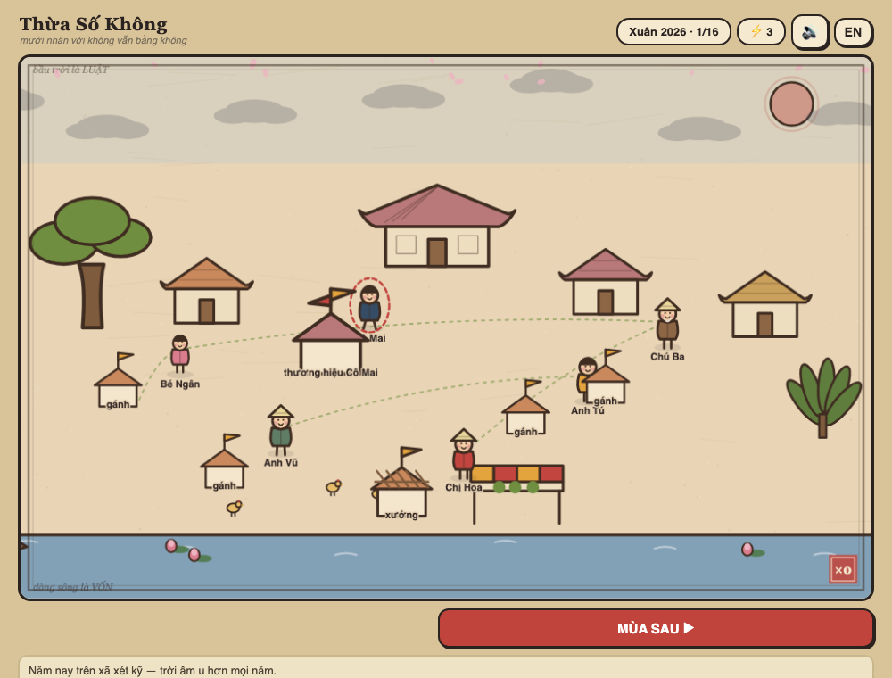
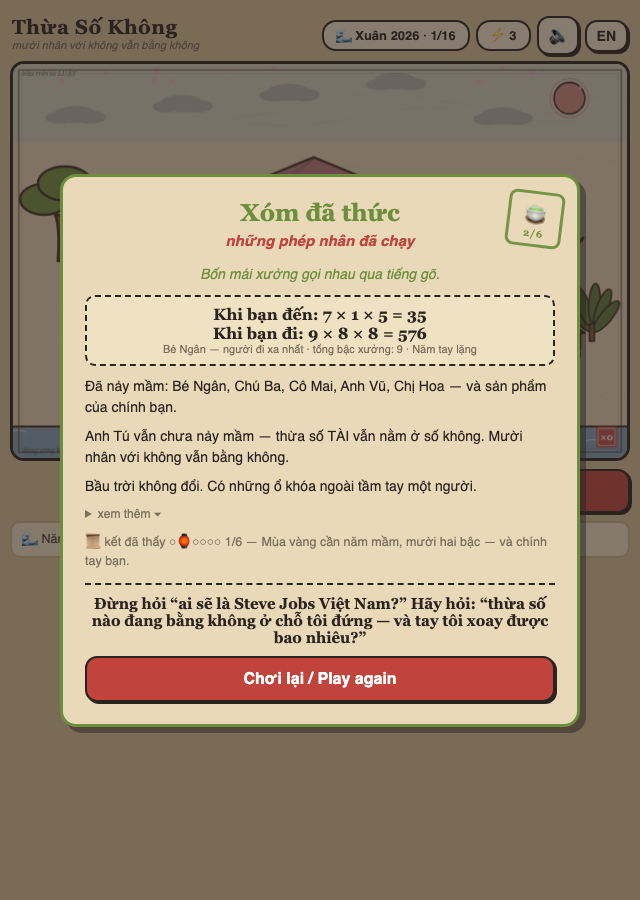

# Thừa Số Không — The Zero Factor

**▶ Chơi ngay / Play now: https://techeese.github.io/thua-so-khong/**

Một xóm nhỏ, sáu con người, mười sáu mùa. Ai cũng chăm chỉ — mà chẳng có gì
nảy mầm. Mỗi mùa bạn có ba việc. Chạm vào từng người, nghe chuyện của họ,
và tìm xem thừa số nào đang đứng ở số không.

*A village game of one multiplication: six named neighbors, sixteen seasons,
three actions per season. Everyone works hard, nothing grows — tap a person,
hear their story, find which factor sits at zero. Bilingual (VI/EN), free,
installable, works offline.*

## Chơi / Playing
- Trình duyệt bất kỳ, không cần cài đặt — hoặc "Add to Home Screen" để chơi offline.
- Nút **EN** ở góc phải chuyển sang tiếng Anh. / The **EN** button switches to English.

## Vì sao có trò này / Why this exists
Trò chơi mọc ra từ một câu hỏi về hệ sinh thái sáng tạo Việt Nam —
"mười nhân với không vẫn bằng không." Phần còn lại, cứ chơi rồi xóm sẽ kể.

## Dev
`open index.html` để chạy local · `./gate.sh` trước khi ship (balance band,
syntax, headless fresh-run, poisoned-save) · `node check.js` cho riêng band ·
`./make-og.sh` tái tạo ảnh share.

## License
MIT — see [LICENSE](LICENSE).
